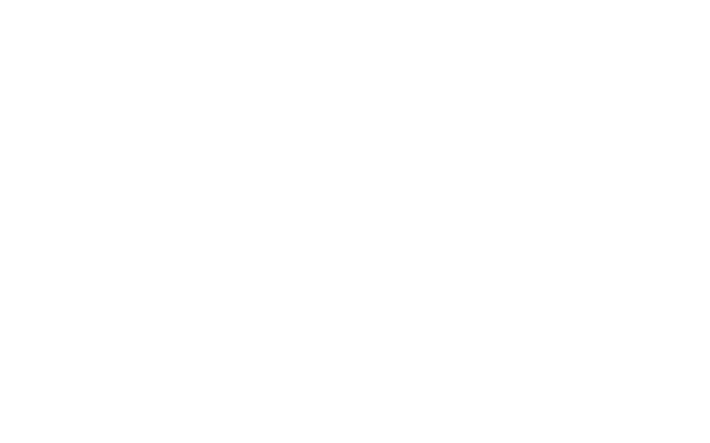

# Voxtrona

<div align="center">
  
  <h1 align="center">Deploy the Core</h1>
  <p align="center">
    <b>Next-Gen Audio Experience for Android & Windows</b>
  </p>
</div>

<div align="center">

[](https://nextjs.org/)
[](https://react.dev/)
[](https://tailwindcss.com/)
[](https://docs.pmnd.rs/react-three-fiber)

</div>

<br />

## 🚀 Introduction

**Voxtrona** is a cutting-edge web platform serving as the central hub for the Voxtrona application suite. It features a highly immersive, sci-fi inspired interface designed to "wow" users from the first interaction.

Built with **Next.js 16 (App Router)** and **React 19**, the site leverages advanced animation libraries like **Framer Motion** and **React Three Fiber** to create a liquid, glassmorphic experience that feels alive.

## ✨ Key Features

- **Premium UI/UX**: A dark, futuristic aesthetic featuring glassmorphism, dynamic gradients, and fluid animations.
- **Interactive 3D Elements**: Particle systems and 3D scenes integrated seamlessly into the DOM.
- **Responsive Design**: Fully optimized for all devices, from ultrawide desktops to mobile phones.
- **Performance First**: Built on Next.js 16 with optimized assets and code-splitting.
- **Direct Downloads**: Easy access to the latest application builds for Android and Windows.

## 🛠️ Tech Stack

- **Framework**: [Next.js 16](https://nextjs.org/) (App Router)
- **Library**: [React 19](https://react.dev/)
- **Language**: [TypeScript](https://www.typescriptlang.org/)
- **Styling**: [Tailwind CSS 4](https://tailwindcss.com/)
- **Animations**: [Framer Motion](https://www.framer.com/motion/)
- **3D Graphics**: [React Three Fiber](https://docs.pmnd.rs/react-three-fiber) / [Drei](https://github.com/pmndrs/drei)
- **Icons**: [Lucide React](https://lucide.dev/)

## ⚡ Getting Started

### Prerequisites

- Node.js 20+ installed on your machine.
- npm or yarn package manager.

### Installation

1.  Clone the repository:

    ```bash
    git clone https://github.com/your-username/voxtrona.git
    cd voxtrona
    ```

2.  Install dependencies:

    ```bash
    npm install
    # or
    yarn install
    ```

3.  Run the development server:

    ```bash
    npm run dev
    ```

4.  Open [http://localhost:3000](http://localhost:3000) in your browser.

## 📂 Project Structure

```
src/
├── app/              # Next.js App Router pages and layouts
├── components/       # Reusable React components
│   ├── ui/           # Basic UI building blocks
│   └── ...           # Complex feature components
├── lib/              # Utility functions and shared logic
└── styles/           # Global styles and tailwind config
public/               # Static assets (images, icons)
```

## 🤝 Contributing

Contributions are welcome! Please feel free to submit a Pull Request.

1.  Fork the Project
2.  Create your Feature Branch (`git checkout -b feature/AmazingFeature`)
3.  Commit your Changes (`git commit -m 'Add some AmazingFeature'`)
4.  Push to the Branch (`git push origin feature/AmazingFeature`)
5.  Open a Pull Request

## 📄 License

Distributed under the MIT License. See `LICENSE` for more information.

---

<div align="center">
  <p>Built with ❤️ by the Voxtrona Team</p>
</div>
